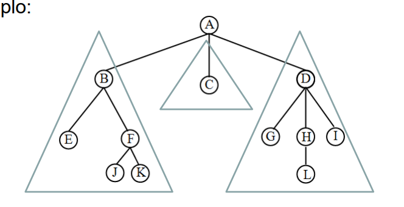
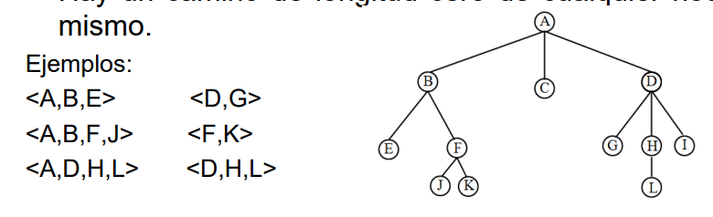
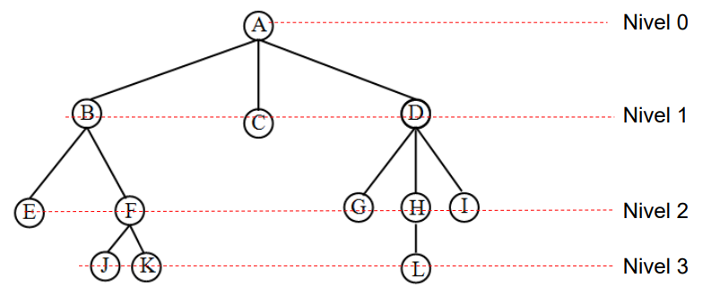
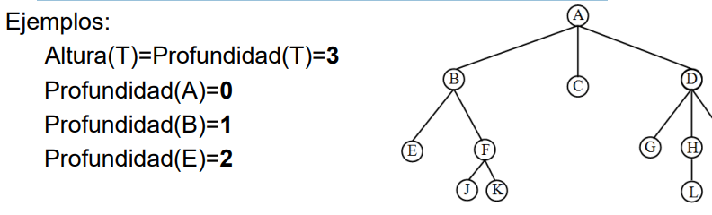
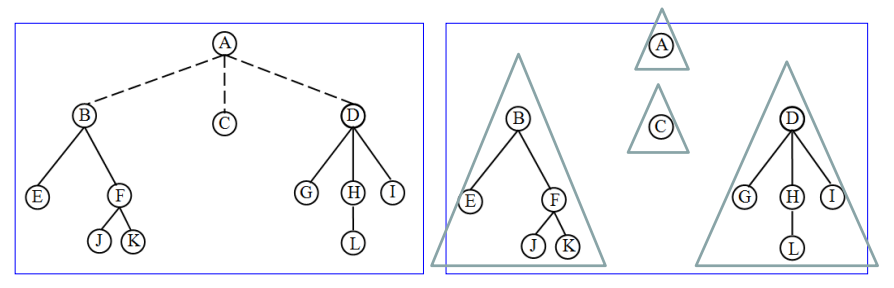
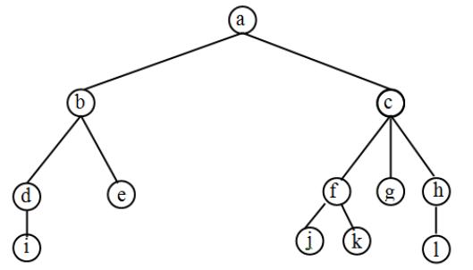
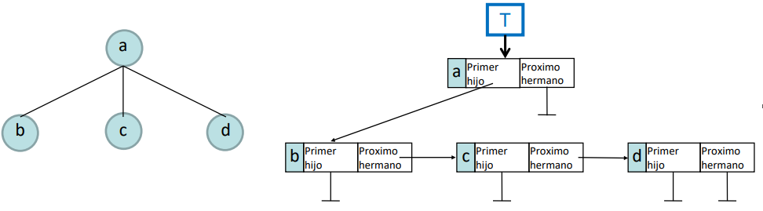
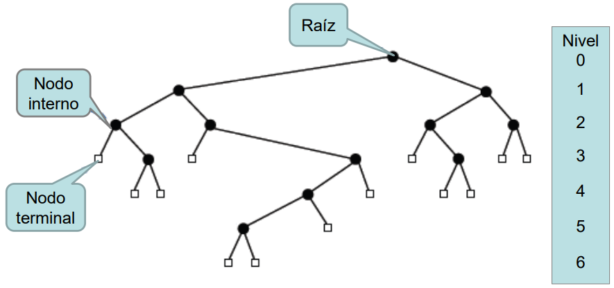
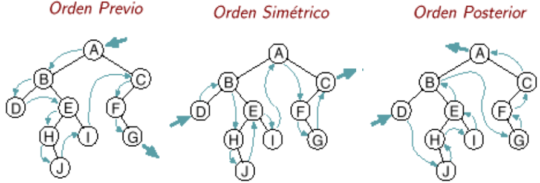

# ARBOL

El arbol es un tipo de dato no lineal, esto significa que a diferencia de 
las estructuras como listas, pilas, y filas sus elementos no se anidan entre si uno a uno.

El arbol impone una estructura jerarquica en una coleccion de objetos

Se usa para representar:
- arboles genealogicos, expresiones aritmeticas, estructuras sintaticas, caminos, organizacion de eventos deportivos, etc.
- Organizar indicas, carpetas y archivos, para asi realizar busquedas eficientes en sistemas de bases de datos.
 
## DEFINICION
Un arbol es una coleccion de objetos denominados **nodos** uno de los cuales se distingue como **raiz**, junto con una relacion que impone una estructura
jerarquica sobre los nodos.

## DEFINICION FORMAL
Un arbol puede definirse de manera recursiva, como un conjunto finito **T** de nodos tales que:
- Hay un nodo **raiz** , cabe aclarar que un nodo solo es por si mismo un arbol.
- Los nodos restantes estan agrupados en m >= 0 conjuntos disjuntos, **T1,   T2, ..., Tn** llamados **subarboles**
- Tambien existe el **arbol nulo** o **vacio**, un arbol tal que no tiene nodos.

## TERMINOLOGIA

- Padre, Hermanos, Hijos.
- Camino, Longitud de Camino.
- Nivel
- Antecesor, Descendiente.
- Antecesor y Descendiente propio o directo
- Hoja o nodo terminal, Nodo interior
- Altura de un arbol
- Profundidad de un arbol
- Grado de un nodo, Grado de un arbol
- Bosque
- **Padre:** cada nodo es padre de sus subarboles
- **Hermanos:** los subarboles que dependen de un mismo nodo son hermanos entre si
- **Hijos:** cada subarbol es hijo de su raiz
-  
- **Camino:** si **n1,n2,...,nk** es una secuencia de nodos de un arbol tal que  **ni** es padre de **ni+1** para 1 <= i < k, entonces la secuencia se denomina camino del nodo **n1** al nodo **nk**
- Hay un solo camino desde la raiz del arbol a cada nodo
- **Longitud del camino:** es el numero de nodos del camino menos uno
- Hay un camino de longitud cero de cualquier nodo a si mismo
-  
- **Nivel:** el nivel de un nodo es el numero de nodos del
camino que va desde la raíz a dicho nodo menos uno.
La raíz principal esta en el nivel 0, sus hijos en nivel 1 y
así. 
- **Antecesor/Descendiente:** Si existe un camino de un nodo A a otro nodo B, entonces. A es un antecesor de B y B es un descendiente de A. Los
antecesores de un nodo son todos los nodos a lo largo del
camino desde la raíz a ese nodo.
- **Antecesor Propio o Directo:** un antecesor propio de un nodo en nivel (i) esta en el nivel (i-1) y sus descendientes propios o directos están en nivel (i+1).
- **Hoja o Nodo terminal:** es un nodo sin descendientes propios
- **Nodo interior:** es un nodo que no sea terminal 
- **Altura de un arbol:** es la longitud del camino mas largo de la raíz a una hoja. 
- **Profundidad de un nodo:** es la longitud del camino único desde la raíz a ese nodo.
- **Profundidad de un árbol:** es el máximo nivel de cualquier hoja del arbol, esto es el camino mas largo desde la raíz a una hoja. Coincide con altura 
- **Grado de un nodo:** es el numero de sus descendientes propios. Las hojas tienen grado cero. 
- **Profundidad de un árbol:** es el máximo de los grados de todos los nodos del árbol.
- **Bosque:** un conjunto de n≥0 arboles disjuntos es un
bosque. *Si en un árbol se suprime la raíz y las aristas que las unen con los subárboles se obtiene un bosque.* 

## RECORRIDO DE UN ARBOL
Es basicamente una lista que contiene las nodos de un arbol, lo cual nos permite posteriormente usarlo para recorridos u otras cosas, recordar que el orden de dicha lista depende del tipo de recorrido que hagamos. 

Si T contiene **un solo nodo**, (Raíz) entonces ese nodo constituye el listado de los nodos de T en los ordenes previo, simétrico y posterior (preorden, enorden, postorden).
- Opre == <Raíz>
- Osim == <Raíz>
- Opos == <Raíz>

### RECORRIDOS
- El listado en **orden previo** (preorden) de los nodos de T esta formado por la Raíz de T, seguida de los nodos de T1 en orden previo, luego los nodos de T2 en orden previo y así sucesivamente hasta los nodos de Tk en orden previo.
    - Opre ≡ < Raiz, Opre(T1), Opre(T2),…,Opre(Tk) >
- El listado en **orden simétrico** (enorden) de los nodos de T esta formado por los nodos de T1 en orden simétrico, seguidos de la Raiz y luego los nodos de T2,…,Tk con cada grupo de nodos en orden simétrico.
    - Osim ≡ < Osim(T1), Raiz, Osim(T2),…,Osim(Tk) >
- El listado en **orden posterior** (postorden) de los nodos de T tiene los nodos de T1 en orden posterior, luego los nodos de T2 en orden posterior y así sucesivamente hasta los nodos de Tk en orden posterior y por ultimo la Raíz.
    - Osim ≡ < Osim(T1), Raiz, Osim(T2),…,Osim(Tk) >

---

***Ejemplo***

- Listado preorden ≡ < a, b, d, i, e, c, f, j, k, g, h, l >
- Listado enorden ≡ < i, d, b, e, a, j, f, k, c, g, l, h >
- Listado postorden ≡ < i, d, e, b, j, k, f, g, l, h, c, a >
- Listado por nivel ≡ < a, b, c, d, e, f, g, h, i, j, k, l >

---
 
### TDA/ADT ARBOL(ITEM)

#### SINTAXIS
- ARBOLVACIO : &rarr; ARBOL
- ESARBOLVACIO : ARBOL &rarr; BOOLEAN
- CONSTRUIR : ITEM X ARBOL X ARBOL &rarr; ARBOL
- PRIMERHIJO : ARBOL &rarr; ARBOL
- PROXHERMANO : ARBOL &rarr; ARBOL
- RAIZ : ARBOL &rarr; ITEM U {indefinido}

#### SEMANTICA: ∀ a,b ∈ ARBOL , ∀ i ∈ ITEM
- ESARBOLVACIO(ARBOLVACIO) ≡ TRUE
- ESARBOLVACIO(CONSTRUIR(i,a,b)) ≡ FALSE
- PRIMERHIJO(ARBOLVACIO) ≡ ARBOLVACIO
- PRIMERHIJO(CONSTRUIR(i,a,b)) ≡ a
- PROXHERMANO(ARBOLVACIO) ≡ ARBOLVACIO
- PROXHERMANO(CONSTRUIR(i,a,b)) ≡ b
- RAIZ(ARBOLVACIO) ≡ indefinido
- RAIZ(CONSTRUIR(i,a,b)) ≡ i

---

# ARBOL BINARIO
Los arboles binarios son un caso particular de arboles tales que en ellos, cada nodo tiene a lo sumo 2 hijos. (puede no tener, o tener uno, no mas de dos)

está compuesto de una raíz y dos subárboles binarios llamados subárbol izquierdo y subárbol derecho.

### TDA/ADT AB(ITEM)

#### SINTAXIS
- ABVACIO : &rarr; AB
- ARMARAB : AB X ITEM X AB &rarr; AB
- ESABVACIO : AB &rarr; BOOLEAN
- IZQUIERDO : AB &rarr; AB
- RAIZ : AB &rarr; ITEM U {indefinido}
- DERECHO : AB &rarr; AB
- PERTENECE : AB X ITEM &rarr; BOOLEAN

#### SEMANTICA: ∀ izq,der ∈ AB, ∀ x,y ∈ ITEM
- ESARBOLVACIO(ARBOLVACIO) ≡ TRUE
- ESABVACIO(ABVACIO) ≡TRUE
- ESABVACIO(ARMARAB(izq,x,der)) ≡ FALSE
- IZQUIERDO(ABVACIO) ≡ ABVACIO
- IZQUIERDO(ARMARAB(izq,x,der)) ≡ izq
- RAIZ(ABVACIO) ≡ indefinido
- RAIZ(ARMARAB(izq,x,der)) ≡ x
- DERECHO(ABVACIO) ≡ ABVACIO
- DERECHO(ARMARAB(izq,x,der)) ≡ der
- PERTENECE(ABVACIO,y) ≡ FALSE
- PERTENECE(ARMARAB(izq,x,der),y) ≡ x=y OR PERTENECE(izq,y) OR PERTENECE(der,y)

#### RECORRIDO A.BINARIO

- Listado preorden ≡ < A, B, D, E, H, J, I, C, F, G >
- Listado enorden ≡ < D, B, H, J, E, I, A, F, G, C >
- Listado postorden ≡ < D, J, H, I, E, B, G, F, C, A >